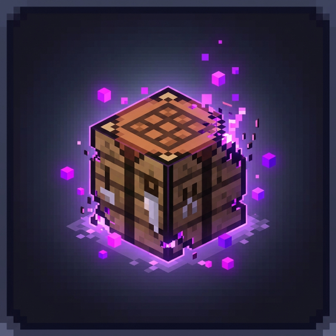
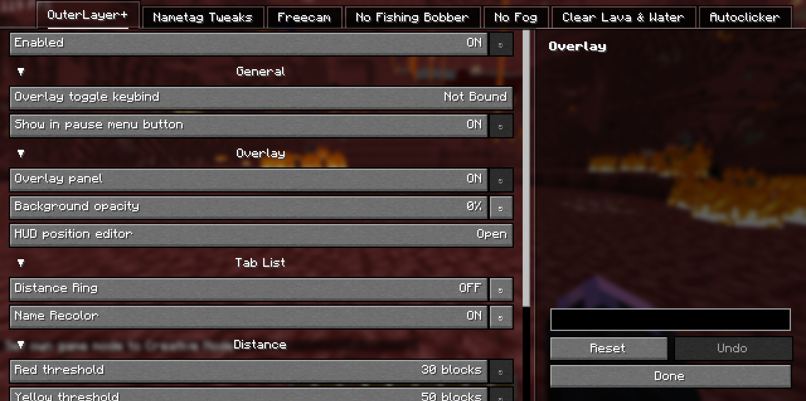

  

<h1 align="center">Null Tweaks</h1>

  A clean client-side Fabric mod for small visual and quality-of-life tweaks.

  <a href="LICENSE">GPL-3.0-only</a> | Minecraft 26.1-26.2 | Fabric Client

## Overview

Null Tweaks keeps a focused set of client-side options in one tidy settings
screen. It is built for players who want small visual cleanup, better HUD
control, and a few practical utility toggles without changing server-side
gameplay.

## Features

- OuterLayer+ for a cleaner player overlay and tab-list presentation.
- Nametag Tweaks for easier player-name visibility.
- Freecam with configurable movement and first-person hand visibility.
- No Fishing Bobber to hide only your local hook sprite while keeping the line.
- No Fog with separate toggles for lava, water, powder snow, effects, and world fog.
- Autoclicker for fixed-interval left or right clicking with a visible active indicator.
- Speed Nuker as an independent opt-in module that attempts multiple eligible blocks per tick with a configurable `1–6` block reach, Full, Protect Below, and Protect Y Level mining modes, an unbound toggle hotkey, absolute standalone blacklist or whitelist filtering, and optional Quarry integration using Quarry's block list and active selection. Its packet rate and reach can trigger anti-cheat, disconnect you, or get you banned; it does not attempt to evade detection.
- Quarry automation for selected boxed or spherical regions, with `/quarry clear` selection reset, absolute blacklist or whitelist filtering across Quarry and Baritone, optional Speed Nuker integration, global Baritone message suppression, configurable player-proximity behavior that defaults to pausing, a three-block mining reach, a wireframe selection overlay, nearest-target startup, layer-continuous serpentine traversal, automatic vegetation skipping in blacklist mode, automatic pausing while any client screen is open, and Baritone-powered pathing.

## Speed Nuker Commands

- `/speednuker on` and `/speednuker off` enable or disable the independent module.
- `/speednuker quarry on` and `/speednuker quarry off` control Quarry integration.
- `/speednuker max <2-64>` sets the maximum number of blocks attempted per tick. Each attempt sends both a START and STOP mining packet, so high values can disconnect you or get you banned.
- `/speednuker reach <1-6>` sets packet-mining reach and snaps it to `0.5`-block increments. Servers may reject or flag reach beyond their allowed interaction distance.
- `/speednuker miningmode protect_below` skips only the block directly beneath your feet, `/speednuker miningmode protect_y_level` skips every block below your current block Y, and `/speednuker miningmode full` applies no positional protection.
- `/speednuker mode blacklist` prevents standalone Speed Nuker from mining listed blocks, while `/speednuker mode whitelist` prevents it from mining anything except listed blocks.
- `/speednuker blocklist add <block>`, `/speednuker blocklist remove <block>`, and `/speednuker blocklist list` manage its standalone list. When Quarry integration and Quarry itself are enabled, Quarry's list is used instead; an active Quarry task also restricts Speed Nuker to the Quarry selection.
- The Speed Nuker settings group includes an unbound toggle keybind that can turn the module on or off directly.

## Quarry Commands

- `/quarry pos1` and `/quarry pos2` set the selected box corners at your current block position.
- `/quarry <radius>` creates a spherical selection centered on your current block position, with radius values from `1` to `64`; use `/quarry start` afterward to begin mining it.
- `/quarry start`, `/quarry pause`, `/quarry resume`, and `/quarry stop` control the active task.
- `/quarry clear` stops Quarry and clears the saved selection and task progress, even if the Quarry feature is currently disabled.
- `/quarry mode blacklist` prevents Quarry and Baritone from mining listed blocks, while `/quarry mode whitelist` prevents them from mining anything except listed blocks. Targets that cannot be reached under these absolute rules are skipped.
- `/quarry chatlogs on` and `/quarry chatlogs off` show or hide Baritone messages.
- `/quarry blocklist add <block>`, `/quarry blocklist remove <block>`, and `/quarry blocklist list` manage the shared block list.
- `/quarry whitelist add <block>`, `/quarry whitelist remove <block>`, and `/quarry whitelist list` remain as compatibility aliases for the shared block list.

## Gallery

  

  Settings are grouped by feature so each tweak stays easy to find.

  

  No Fog can remove specific fog types without changing gameplay.

  

  Nametag Tweaks keeps player names easier to read at a glance.

## Requirements

- Required: [Fabric Loader](https://fabricmc.net/use/installer/)
- Required: [Fabric API](https://modrinth.com/mod/fabric-api)
- Required: [YetAnotherConfigLib](https://modrinth.com/mod/yacl)
- Required: [Mod Menu](https://modrinth.com/mod/modmenu)
- Optional for Quarry: Quarry currently uses Baritone for pathing and movement.
  For local testing, install a compatible Fabric Baritone jar, or a fork such
  as [Null-Baritone](https://github.com/NullKeeper-dev/Null-Baritone), beside
  Null Tweaks. If no compatible Baritone is loaded, Null Tweaks shows a join
  warning with a Null-Baritone download link and a persistent "Don't show
  again" option. A single-jar release would require bundling or replacing the
  Baritone integration; until then, Quarry will not start unless a compatible
  Baritone API or command-capable Baritone fork is loaded. With API-capable
  builds, Quarry also feeds its reach and absolute block rules into path planning.

See [DEPENDENCY_MODS.md](DEPENDENCY_MODS.md) for the exact dependency versions
used by each supported Minecraft release.

## Download

Use the Null Tweaks jar that matches your Minecraft version:

- `26.1`
- `26.1.1`
- `26.1.2`
- `26.2`

Install it in your `mods` folder with the required dependency mods, then open
the Mod Menu entry to configure each feature.
